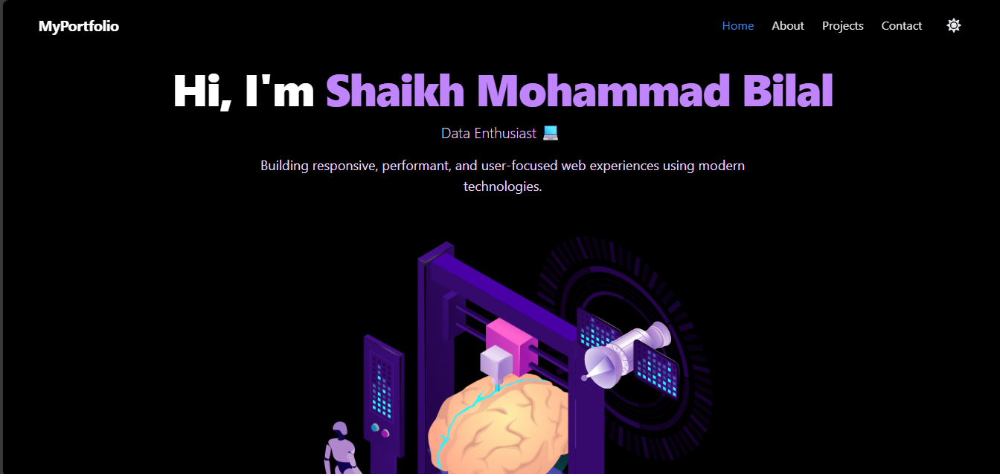

# 💼 Shaikh Bilal – Portfolio Website

A dynamic, modern, and responsive portfolio website built using **Next.js**, **Tailwind CSS**, and **Framer Motion**, designed to showcase projects, skills, testimonials, and contact information. Content is fully data-driven via JSON, making updates easy and scalable.

---

## 🚀 Tech Stack

- **Framework:** Next.js (App Router)
- **Styling:** Tailwind CSS
- **Language:** TypeScript
- **Animations:** Framer Motion
- **Forms & Validation:** HTML + Zod
- **Dark Mode:** next-themes
- **Content Source:** Local JSON files
- **Hosting:** Vercel

---

## 📂 Project Structure

src/
├── app/ or pages/ # Routing
├── components/ # Reusable UI (Header, Footer, Card, etc.)
├── sections/ # Home, About, Projects, Contact
├── data/ # JSON content (projects, skills, testimonials)
├── styles/ # Tailwind config + global/theme CSS
├── utils/ # fetchProjects, formValidator, etc.
├── types/ # TypeScript interfaces

## 🧠 Key Features

- 🔥 Responsive design with dark mode
- 💬 Animated sections on scroll
- ⚡ JSON-powered projects, skills, testimonials
- ✅ Type-safe form validation with Zod
- 📤 Resume download button
- 🌐 Deployed to [Vercel](https://vercel.com)

---

## 📸 Pages / Sections

| Section     | Description                              |
|-------------|------------------------------------------|
| Hero        | Welcome message, name, CTA buttons       |
| About       | Background, education, career journey    |
| Projects    | Filterable list of categorized work      |
| Contact     | Form with validation + social links      |

---

## 📄 Local Setup

1. **Clone the repo:**

   git clone https://github.com/shaikh219/portfolio.git
   cd portfolio
Install dependencies:
npm install
Run locally:
npm run dev
Visit http://localhost:3000

🧪 Testing
npm run test
Unit tests written with Jest and React Testing Library (e.g. ProjectCard.test.tsx)

📁 Deployment
This site is deployed using Vercel with automatic GitHub CI/CD.

Push to main branch = instant production update.

🙌 Credits
Next.js

Tailwind CSS

Framer Motion

Zod

React Icons

Vercel

📬 Contact
📧 Email: bilalbagmar@gamil.com

🌐 LinkedIn: linkedin.com/in/shaikh-bilal-bagmar219

Built with ❤️ by Shaikh Bilal

